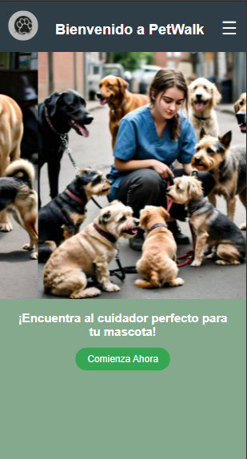

# PetWalk Proyecto 7°3

PetWalk es una iniciaiva desarrollada por un equipo de programadores y diseñadores que busca ofrecer un servicio innovador, seguro y amigable para los amantes de las mascotas. Inspirado en la dinámica de aplicaciones como Uber, PetWalk transforma la experiencia de pasear perros al proporcionar un servicio de paseadores que garantizan comodidad, diversión y seguridad tanto para las mascotas como para sus dueños.

---

## ¿Qué es PetWalk?
PetWalk es una plataforma que conecta a paseadores de perros experimentados con dueños de mascotas que buscan un servicio confiable y profesional. En lugar de transportar personas, nuestros paseadores brindan recorridos preestablecidos y adaptados a las necesidades de cada perro, asegurando una experiencia única.

---

## Objetivos de PetWalk
Nuestro objetivo principal es brindar una solución integral para facilitar el cuidado y el disfrute de las mascotas mediante:

- Conexión segura entre paseadores y dueños de mascotas.
- Gestión eficiente y transparente de los servicios contratados.
- Optimización de la experiencia de paseo para las mascotas.
- Fomentar la confianza mediante el seguimiento en tiempo real y perfiles verificados.
- Características principales
- Gestión de paseos personalizados: Los dueños pueden elegir la duración y la ruta del paseo.
- Seguridad en primer lugar: Monitoreo en tiempo real de la ubicación del paseador y uso de bozales para perros ansiosos o agresivos (proporcionados por los dueños).
- Perfiles verificados: Antes de cada paseo, los dueños pueden revisar la información del paseador, incluyendo experiencia, - contactos y una breve descripción.
- Experiencia escalable: Paseadores experimentados pueden manejar varios perros a la vez, garantizando un entorno controlado y seguro.
- Soporte al cliente: Un equipo dedicado para responder dudas y gestionar cualquier inconveniente.
Nuestra Visión
PetWalk aspira a ser el servicio líder en la industria de paseos para mascotas, brindando confianza, seguridad y felicidad tanto a los dueños como a sus perros. A largo plazo, buscamos crear una comunidad donde dueños y paseadores compartan experiencias y aprendan juntos sobre el bienestar de las mascotas.

---

## ¿Qué encontrarás en PetWalk?
La página principal de PetWalk es la entrada a un servicio pensado para satisfacer tanto a dueños como a paseadores de mascotas:

---

### Inicio intuitivo: Navegación fácil para explorar las funcionalidades principales.
### Registro de usuarios y perros: Un sistema simple y directo para que los dueños registren a sus mascotas y programen paseos.
### Perfiles de paseadores: Cada paseador cuenta con un perfil detallado para generar confianza y transparencia.
### Seguridad: Nuestra prioridad
### Selección rigurosa de paseadores mediante procesos de validación y capacitación.
### Evaluaciones personalizadas del comportamiento de los perros antes de cada paseo.

---

## Gestión para paseadores

### PetWalk también incluye un panel exclusivo para paseadores, donde pueden:

- **Actualizar su perfil y disponibilidad**.
- **Gestionar solicitudes de paseos**.
- **Acceder a métricas sobre su desempeño y satisfacción de los clientes**.
  
## Tecnología utilizada
### Para desarrollar PetWalk, hemos empleado un conjunto de herramientas modernas y eficientes:

- **Frontend:** HTML, CSS (Bootstrap), JavaScript.
- **Backend:** PHP.
- **Base de datos:** MySQL para una gestión robusta de usuarios, mascotas y paseos.

---

### Conclusión

PetWalk no es solo una aplicación; es una experiencia diseñada para transformar la manera en que cuidamos y disfrutamos del tiempo con nuestras mascotas. Nos comprometemos a ofrecer el mejor servicio con la máxima seguridad y confiabilidad.

## Este es el index de la pagina

