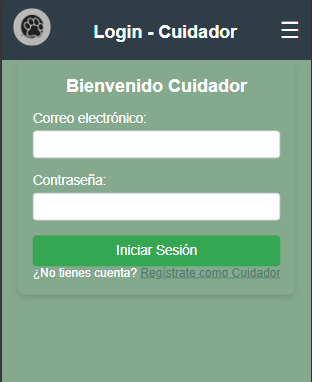

<h1>PetWalk: Proyecto M&S</h1>
 
 
 

A través de este medio presentamos **PetWalk**, un proyecto desarrollado por un equipo de analistas y programadores. Este proyecto busca revolucionar el cuidado y bienestar de las mascotas a través de un servicio confiable y accesible. Nuestro objetivo principal es proporcionar una plataforma digital que permita:

<ul>
<li>Conectar paseadores experimentados con dueños de mascotas.</li>
<li>Ofrecer información clara y completa sobre los paseadores, como experiencia y contacto.</li>
<li>Garantizar la seguridad y comodidad de las mascotas durante el paseo.</li>
<li>Permitir a los dueños monitorear en tiempo real la ubicación de sus mascotas.</li>
</ul>

**PetWalk** es un servicio que funciona de manera similar a Uber, pero enfocado en paseadores de perros. La plataforma está diseñada para brindar una experiencia cómoda, segura y divertida para las mascotas, mientras ofrece a los dueños control total y tranquilidad. Utilizamos tecnologías como **HTML**, **CSS**, **JavaScript** y **Python**, junto con herramientas como **Bootstrap**, para desarrollar un sistema robusto y fácil de usar.

<h4>¿Cómo lo logramos?</h4>
Con **PetWalk**, los paseadores experimentados pueden manejar varias mascotas al mismo tiempo, mientras que los perros ansiosos o peligrosos deben llevar un bozal proporcionado por el dueño. Nuestra misión es facilitar este proceso para los usuarios, ofreciendo una interfaz intuitiva, seguridad garantizada y soporte constante. 

El futuro de **PetWalk** incluye el crecimiento de la comunidad de paseadores y dueños de mascotas, promoviendo un entorno de confianza y profesionalismo.

---

<h4>Este es el inicio de la página</h4>

<h4>¿Qué encontrarás aquí?</h4>
La página principal es donde comienza la experiencia **PetWalk**. Aquí podrás:
<ul>
<li>Explorar servicios destacados y conocer paseadores.</li>
<li>Acceder al menú principal: Ubicado en la parte superior, permite navegar por todas las secciones del sitio.</li>
</ul>

---

<h5>Sección de Paseadores</h5>  
En esta sección, los usuarios podrán buscar y filtrar paseadores en su zona, además de visualizar su información de contacto, experiencia y descripciones personalizadas.  

<h5>Sección de Mis Mascotas</h5>  
Aquí, los usuarios pueden registrar sus mascotas, añadiendo detalles como raza, edad y comportamientos particulares. 

<h5>Sección de Paseos Activos</h5>  
Los usuarios podrán monitorear en tiempo real la ubicación de sus mascotas durante el paseo.  

<h5>Seguridad y Monitoreo</h5>  
La seguridad es nuestra prioridad. Con **PetWalk**, los paseos son rastreados en tiempo real, garantizando que los dueños estén informados en todo momento. 

<h5>Gestión del Perfil de Paseador</h5>
Los paseadores registrados tendrán acceso a un panel donde podrán:
<ul>
<li>Actualizar su perfil e información de contacto.</li>
<li>Visualizar los paseos activos y sus historiales.</li>
<li>Establecer disponibilidad de horarios y zonas de cobertura.</li>
</ul>

<h5>Dashboard de Administrador</h5>
El administrador tiene acceso exclusivo a un dashboard donde puede:
<ul>
<li>Gestionar perfiles de usuarios y paseadores.</li>
<li>Monitorear el correcto funcionamiento de la plataforma.</li>
<li>Implementar cambios o ajustes en tiempo real.</li>
</ul>

---

> Equipo de Desarrollo:  
> - Chamorro Santiago  
> - Díaz Agustín  
> - González Mariano
