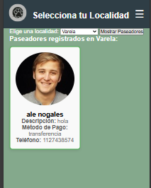

<h1>PetWalk: Proyecto M&S</h1>
 
 
 

A través de este medio presentamos **PetWalk**, un proyecto desarrollado por un equipo de analistas y programadores. Este proyecto busca revolucionar el cuidado y bienestar de las mascotas a través de un servicio confiable y accesible. Nuestro objetivo principal es proporcionar una plataforma digital que permita:

<ul>
<li>Conectar paseadores experimentados con dueños de mascotas.</li>
<li>Ofrecer información clara y completa sobre los paseadores, como experiencia y contacto.</li>
<li>Garantizar la seguridad y comodidad de las mascotas durante el paseo.</li>
<li>Permitir a los dueños monitorear en tiempo real la ubicación de sus mascotas.</li>
</ul>

**PetWalk** es un servicio que funciona de manera similar a Uber, pero enfocado en paseadores de perros. La plataforma está diseñada para brindar una experiencia cómoda, segura y divertida para las mascotas, mientras ofrece a los dueños control total y tranquilidad. Utilizamos tecnologías como **HTML**, **CSS**, **JavaScript** y **PHP**, junto con herramientas como **Bootstrap**, para desarrollar un sistema robusto y fácil de usar.

<h4>¿Cómo lo logramos?</h4>
Con <strong>PetWalk</strong>, los paseadores experimentados pueden manejar varias mascotas al mismo tiempo, mientras que los perros ansiosos o peligrosos deben llevar un bozal proporcionado por el dueño. Nuestra misión es facilitar este proceso para los usuarios, ofreciendo una interfaz intuitiva, seguridad garantizada y soporte constante. 

El futuro de **PetWalk** incluye el crecimiento de la comunidad de paseadores y dueños de mascotas, promoviendo un entorno de confianza y profesionalismo.

---

<h4>Este es el inicio de la página</h4>

<h4>¿Qué encontrarás aquí?</h4>
La página principal es donde comienza la experiencia <strong>PetWalk</strong>. Aquí podrás:
<ul>
<li>Explorar servicios destacados y conocer paseadores.</li>
<li>Para poder acceder a estos servicios primero deberas iniciar sesion.</li>
</ul>

---

<h5>Sección de Paseadores</h5>  
En caso de que seas un paseador queriendo iniciar sesion deberas ir al apratado del login de cuidador.

---

<h5>Sección de Registro del Cliente</h5>  
Esta seccion esta destinada para los usuarios que no tienen una cuenta del sitio web. Los usuarios que quiera ser clientes pueden registrarse para acceder a las funciones de los mismos. 

---

<h5>Sección de Registro del Paseador</h5>  
Este apartado fue diseñado para los usuarios que no tienen una cuenta y quieran registrarse como paseadores.

---

<h5>Gestión del Perfil de Paseador</h5>  
Los paseadores registrados tendrán acceso a un panel donde podrán:
<ul>
<li>Actualizar su perfil e información de contacto.</li>
<li>Visualizar los paseos activos y sus historiales.</li>
<li>Establecer disponibilidad de horarios y zonas de cobertura.</li>
</ul>
  

---

<h5>Busqueda de Paseadores</h5>
Los clientes registrados tendrán acceso a una barra de busqueda donde podrán buscar paseadores disponibles segun su misma localidad.

---

<h5>Logo de PetWalk</h5>

---

> Integrantes del Desarrollo del Proyecto M&S PetWalk:  
> - Fernandez Coytino Dylan Ismael 
> - Lopez Francia Axel 
> - Montenegro Gonzalo
> - Nogales Maldonado Matias Nicolas
